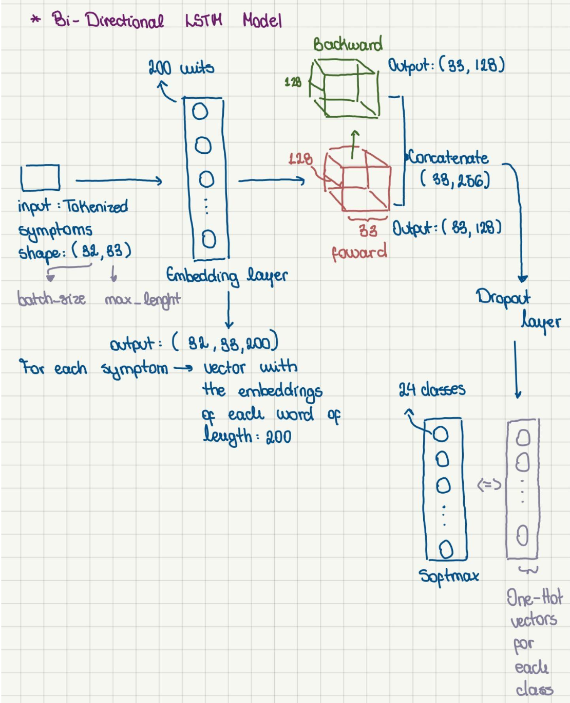
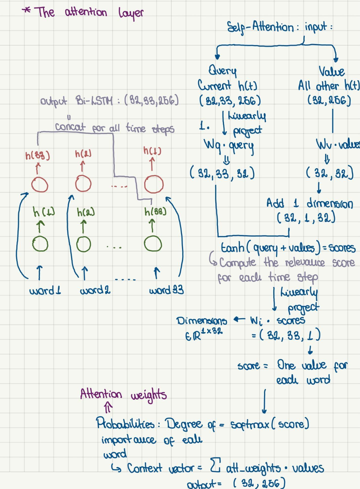
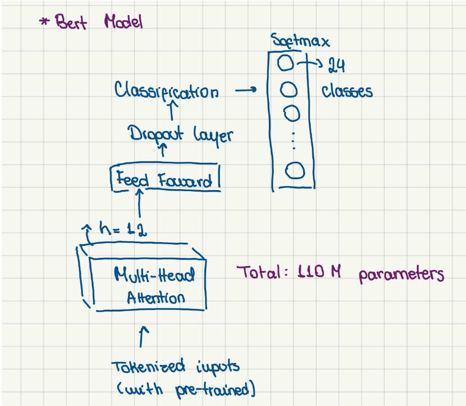
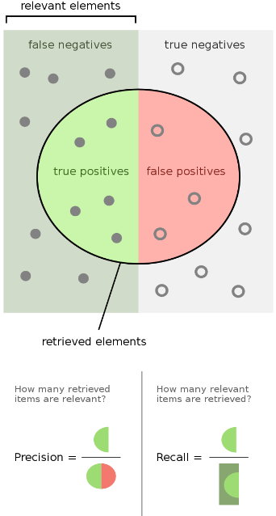
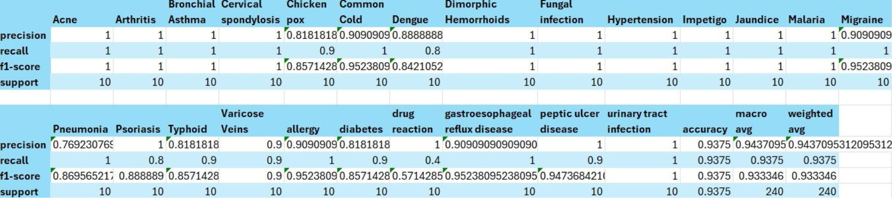
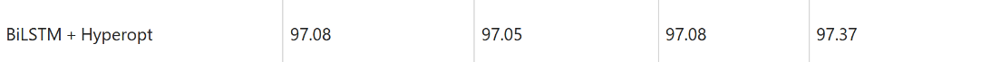
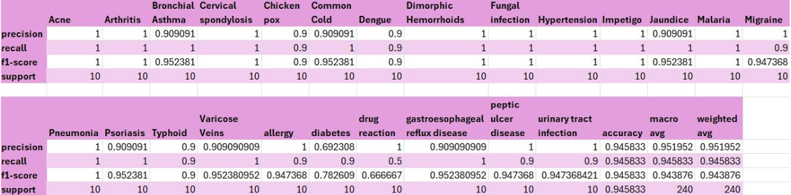
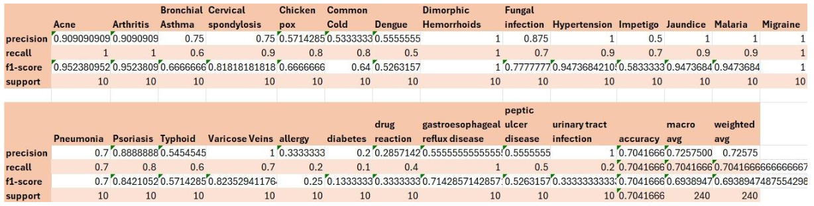
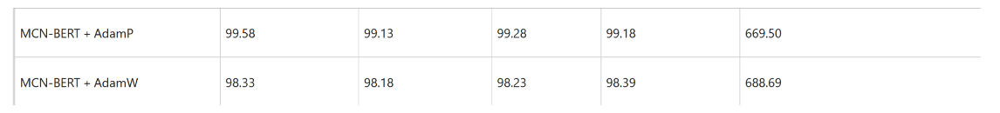

# Introduction

In this project we will showcase the performance of two different models for diagnosis classification based on symptoms written in natural language. The task involves a multiclass classification of symptoms for 24 possible diagnosis. 

Classification it's an usual NLP task, for which we decided to use two neural models: a Bi-Directional LSTM (Recurrent Neural Network) because of it recurrent structure, processing inputs through a series of temporal steps where each step's output feeds into the next capturing patterns and relations between words. But with base RNNs there are two main problems:

- Not being able to retain long-term dependencies within our input, as our hidden states only take information coming from the previous time step

- Unidirectionality

The first problem can be solved by introducing Long short term memory (LSTM) cells in our model that will compute a context vector by taking the information coming from the hidden states and the input and applying a series of transformations that allow us to select the important information to retain. As we will also consider the context vector of all the previous steps we are able to capture long-term relations.

The problem of unidirectionality can be easily solved by considering Bi-Directional RNNs in which we will stack two layers of RNNs (can also be LSTM gates) that will process our input in opposite directions, concatenating their outputs to form a unique representation.

The second model we will consider it's BERT (Bi-Directional Encoder Representations from Transformers)  a Transformer model, that by nature it's bidirectional by making use of the attention mechanism. BERT in specific it's an encoder only Transformer, meaning that it will only make use of Self-attention. The overall structure for this model it's composed by a series of transformer blocks followed by a fully connected dense layer, the variant we chose to use consists only 12 transformer blocks containing the Self-Attention heads.

At least we will also consider a LSTM variant model adding an attention layer. Attention has the job of dealing with the problem of the *"bottleneck"* for the LSTM. Because all our representation it's compressed into one final hidden state that contains all the relevant information of the sequence, but with attention we are able to consider not only this last hidden state for the final output, but we compute a final context vector that will be the weighted sum of all our hidden states weighted by the importance of each of them (in our case of *self-attention)*. By computing the scores of our hidden states and the last hidden state we can find which hidden states are the ones that contribute the most. In Transformers, attention mechanisms facilitate bidirectionality and long-term relationship modeling.

# Data

The data it's taken from the research paper "*Optimizing classification of diseases through language model analysis of symptoms*". It includes 1200 samples of symptoms each paired with one of 24 diagnoses. The dataset is balanced, with approximately 50 samples per class (around 4.2% per class).

# Methodology

### 1. Preprocessing of the text

Text preprocessing involves:

1. Splitting by whitespace, converting to lowercase, removing stopwords (e.g., _the, a, and_), and punctuation.
2. Lemmatization of verbs using _WordNetLemmatizer_ (mapping words to their *lemma*: base dictionary form).
3. Padding sequences on the left to ensure uniform length for LSTM inputs.
4. For BERT, using a pre-trained BERT tokenizer to generate input IDs and attention masks.
5. Mapping target labels to unique integers for classification.

### 2. Defining the models
### Bi-Directional LSTM

The model comprises:

1. An embedding layer (with _mask_zero = True_) to convert inputs into vector representations of dimension _out_dimensions_ (tuned as a hyperparameter).
2. A Bi-Directional LSTM layer.
3. Dropout layers for regularization to avoid overfitting.

Adding dense layers post-LSTM worsened performance, possibly due to the model not suffering significantly from the "bottleneck" issue given the small sequence length (33 steps).

### Attention layer

To enhance the capability of our model to focus on relevant information, we incorporated an attention layer. Following this layer, we employed a dense layer to ensure that the dimensions of the context vector are appropriately aligned before reaching the output layer. This step is crucial, particularly compared to models lacking attention mechanisms. As the output of the attention layer it's a vector of weights computed as the weighted some of the scores with the values vector:

$$
\text{context\_vector}(q, V) = \sum_{i} \text{attention\_weights}(q, V)\_i \cdot v\_i
$$

Introducing a dense layer aids in providing a meaningful representation to these weights, thus refining the model's decision-making process. 

For the attention scores (computed between the query and value vector, because we are implementing self-attention the values vector are the previous hidden steps while the query it's the current hidden state) we will use the additive score with the $tanh$ function, 
$$
\text{score}(q, v) = \text{tanh}(W\_q q + W\_v v)
$$

Which we tell us how important are two vectors with respect to each other. In the code this step it's done by the linear projection of the scores to a dimension of 1, in which we will get a scalar (relevance) for each time step. Afterwards these scores we will be transformed into a probability distribution for all time steps using a `softmax` that will give us the `attention_weights`
$$\text{attention\_weights}(q, V) = \text{softmax}(\text{score}(q, V))$$
which we will later inspect so we can check which words the model it's paying more attention towards

 
### Fine-Tuning a BERT model

We will be using the TensorFlow Hub to instantiate the BERT model, converting a PyTorch model to a Keras model, so that all attributes of keras’ can be used. The function takes as argument the inputs with corresponding attention masks. Because we are fine-tuning the model, we will add our classification layer specific for our task but the weights will not be “frozen” as we will train the weights of the model again on our data. The model we instantiate it’s the Bert Base Model Uncased, trained with Wikipedia and Bookcorpus for the objective of masked language modeling and next sentence prediction, even though these tasks are not the most aligned for our use case, we hope that the model will still be able to perform fairly well on our “simple” dataset. This model has 12 attention heads and in total has 110 million parameters.

## 3. Hyperparameter Optimization

For hyperparameter optimization and model selection we decided to perform a 5-fold-cross-validation for both the models.

In the cross-validation we are splitting only the train set into validation, leaving the test set we splitted at the beginning unseen as we will check the performance in this test set only with respect to our best model found after cross-validation.

### Hyperparameters for LSTM

1. **Embedding Dimension**: 50, 100, 200 dimensions.
2. **Number of LSTM Units**: 32, 64, 128 units (doubled for Bi-Directional LSTM).
3. **Learning Rate**: Uniform distribution between 0.0001 and 0.01.
4. **Dropout Rate**: Uniform distribution between 0.3 and 0.6.

### Hyperparameters for BERT

1. **Learning Rate**: Same distribution as LSTM.
2. **Dropout Rate**: Same distribution as LSTM.

# Result and Analysis
We will present our results while also comparing them with respect to the ones obtained on the previously mentioned paper.
The main metrics that we are considering are:
- Precision, number of true positive over all the positives (considers false positives)
- Recall, number of true positives over all the positive predictions (also considering false negatives)
- F1-Score: The harmonic mean of precision and recall, because our dataset it’s completely balanced the macro, and weighted F1-Scores are equal, so we will consider the macro scores
- Accuracy, the percentage of correct predictions

## Bi-Directional LSTM
The best hyperparameters were:
- Embedding Dimension : 200
- N_units of the LSTM : 32
- Learning rate : 0.006860548790690411
- Dropout rate : 0.46132499448222186

They are close to the ones obtained by the paper, even though they obtained higher scores overall. Probably as they used `Hyperopt` for hyperparameter optimization and also used a tokenizer specialized to medical terms as stated on the paper *“A preprocessing step involved the meticulous tokenization of these symptom descriptions, achieved through the utilization of a specialized medical tokenizer designed for enhanced contextual understanding of medical terms”*

## Bi-Directional LSTM with Attention Mechanism
With the attention mechanism we found better results for precision and recall as probably the model
with the context vector (weighted sum of each hidden state with the attention weights) was able to just
focus on the relevant states for the classification (as we can see by inspecting the attention weights).
In both models though we can see that it was having troubles differentiating drug reactions with
diabetes probably due to how the symptoms were written by the patients, in which they could have used
similar words.

## Pre-Trained BERT model
With the BERT model we found a lot of problems with the instantiation of the model which probably caused some performance problems. Also we chose to fine-tune the model which was probably not the best choice as our dataset it’s rather small retraining a large and complex model like BERT probably requires many more examples and epochs as we only consider 50 (same as the paper) because the fitting times were significantly high.
We opted to use the same hyperparameters that were used in the paper (except for the learning rate, in which we used the one found for the LSTM model)

Performances for the BERT model on the paper:

# Conclusion
This project demonstrated the efficacy of Bi-Directional LSTM and BERT models for symptom
classification tasks. While the LSTM models performed well, the BERT model's performance was limited
by the small dataset and high computational requirements. We also demonstrate the importance of
hyperparameter optimization as we found better performances with respect to our base model (85% accuracy).

## Some implementation problems
With the Bi-Directionall LSTM we didn’t find many problems, such as the creation and training of the model. With the attention on the other hand we encounter some problems with keras’ attention layer, so that’s why we decided to instantiate our own attention layer, as the keras’ one was having problems with the inputs and the attention masks were not implemented. Even though on our own implementation we weren’t able to take into consideration the masks of the padded inputs, after the training of the model we inspected the output of the attention weights as it was giving very low scores to all the padded inputs pointing out that it’s working correctly.

# References
Hassan, E., Abd El-Hafeez, T. and Shams, M.Y. (2024) *Optimizing classification of diseases through
language model analysis of symptoms, Nature News*. Available at:
https://www.nature.com/articles/s41598-024-51615-5#Sec33 (Accessed: 23 June 2024)
